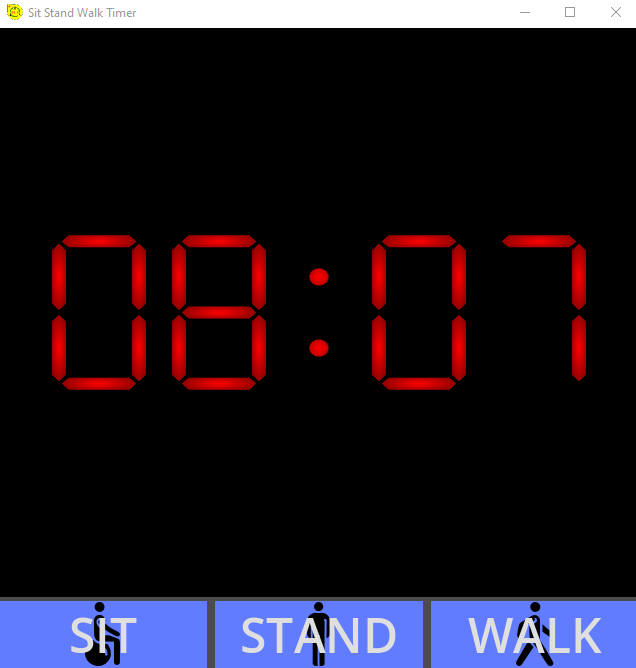

<!-- { width="50%"} -->

# Optimal Sit-Stand-Walk

In order to maximize results I've used CGPT to collect and distill research for optimal results. To fill a 8 hr workday, the maximums for daily total time and individaul interval posisitions were used.

A one day project that uses Godot 4+ as an new dev environment, new language and experiments with the power of shaders with and segmented clock from shader tutorial. AI was tested as a "peer" developer with limited benefit in development but a boost in research and refinement 
hopefully no hallucinations in sources :) 

# Research and Results

| **Activity**          | **Recommended Duration** | **Health Benefits**                                         | **Supporting Research**                                                                                                          | **Key Findings**                                                                                                                 |
|-----------------------|--------------------------|--------------------------------------------------------------|----------------------------------------------------------------------------------------------------------------------------------|-----------------------------------------------------------------------------------------------------------------------------------|
| **Sitting (on ball)** | 10 minutes per cycle     | Core engagement, reduced back strain                         | Gregory, D. E., & Dunk, N. M. (2011). *Stability ball sitting vs. office chair: Core muscle activation*. Journal of Electromyography and Kinesiology.              | Stability balls can increase core engagement but may lead to discomfort if used longer than 2 hours daily.                       |
| **Standing**          | 5 minutes per cycle      | Improved circulation, breaks sedentary pattern               | Straker, L., et al. (2018). *Effect of different seated and standing work patterns on cognitive and physical health*. Applied Ergonomics.                            | Standing every 30-60 minutes helps alleviate venous strain and reduces sedentary risks when limited to brief intervals.          |
| **Walking**           | 25 minutes per cycle     | Boosts metabolism, reduces sedentary health risks            | Dunstan, D. W., et al. (2012). *Breaking up prolonged sitting reduces postprandial glucose and insulin levels*. Diabetes Care.                                     | Walking every 20-30 minutes significantly improves metabolic health and mitigates risks associated with prolonged sitting.       |
| **General Cycle**     | 40 minutes total         | Balanced activity minimizes risks associated with sedentary behavior | Ekelund, U., et al. (2016). *Does physical activity attenuate, or even eliminate, the detrimental association of sitting time with mortality?* Lancet.         | Cycles that alternate sitting, standing, and walking are associated with reduced all-cause mortality, especially for prolonged sitting patterns. |

# Screenshot

Shader based clock with simple buttons

# Functionality 

- Pause and switch between timers with a click
- Resume
- Shader timer display
- automatically cascades from each position with audio notification sit->stand-> walk->sit-> etc.

# Additonal Information

## Key Factors in Optimization
### 8-Hour Workday Constraint:

- The routine was structured to fit within a standard 8-hour workday (480 minutes), with intervals designed to evenly distribute activity throughout the day, thus promoting sustained engagement and minimizing prolonged sedentary behavior.

### Limiting Sitting Time:

- Sitting on the exercise ball was limited to a total of 2 hours per day (120 minutes), as extended sitting is associated with an increased risk of cardiovascular disease and musculoskeletal strain. By capping each sitting interval at 10 minutes, we avoid prolonged exposure to the risks of static posture and ensure regular movement.
- The exercise ball, while beneficial for core engagement, can cause discomfort if used excessively, so sitting is broken into short, manageable periods spread across 12 cycles.

### Minimizing Standing Duration:

- Standing periods were limited to 5 minutes per cycle to avoid the negative effects of prolonged standing, such as venous pooling and increased risk of varicose veins. Research indicates that standing for extended periods (over 8 minutes at a time) without movement can lead to lower limb discomfort and circulatory issues.
- Standing was kept brief to minimize strain while allowing circulation to improve between sitting and walking intervals.

### Maximizing Walking Benefits Without Overextending:

- Walking periods were set at 25 minutes per cycle, which is within the recommended range for achieving health benefits while avoiding fatigue or strain. - - Walking helps to counteract the effects of sitting and standing, boosting circulation, metabolism, and cognitive function.
- Research suggests that walking for up to 10 minutes at a time provides optimal health benefits in a work setting; therefore, walking was distributed across longer cycles without exceeding 25 minutes to prevent diminishing returns or fatigue.

### Balanced 40-Minute Cycle:

- Each 40-minute cycle consists of 10 minutes of sitting, 5 minutes of standing, and 25 minutes of walking, creating a rhythm that alternates between activities. This structure ensures a balanced approach, allowing for movement every few minutes and limiting each posture’s potential drawbacks.
- Over an 8-hour workday, this cycle is repeated 12 times, providing consistent movement while adhering to the daily and interval-based limits for each activity type.

## Summary 

By applying these constraints, the routine leverages the benefits of each activity—core engagement from the exercise ball, circulation improvement from standing, and metabolic boosts from walking—while maintaining a healthy balance and avoiding the adverse effects associated with excessive sitting, standing, or walking.